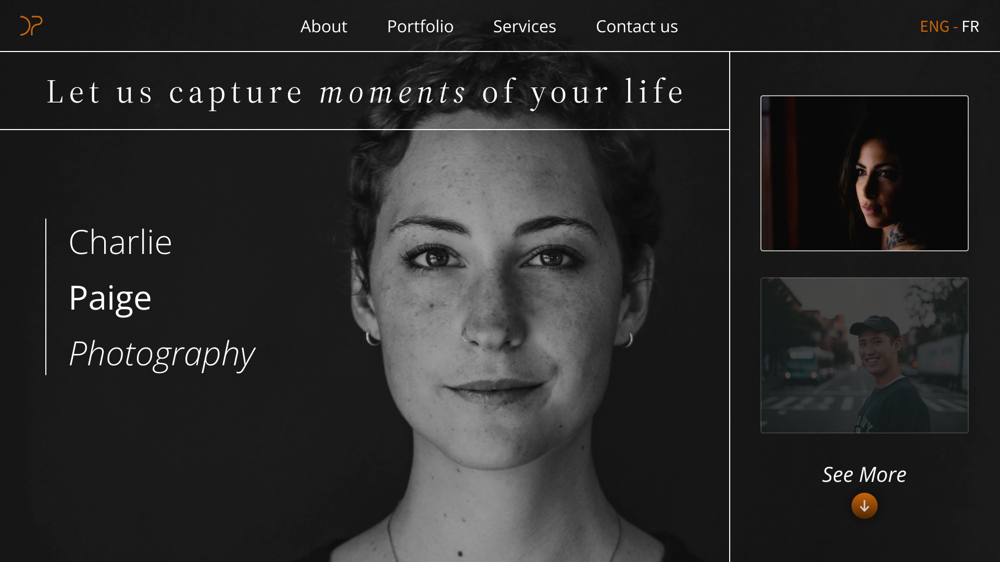
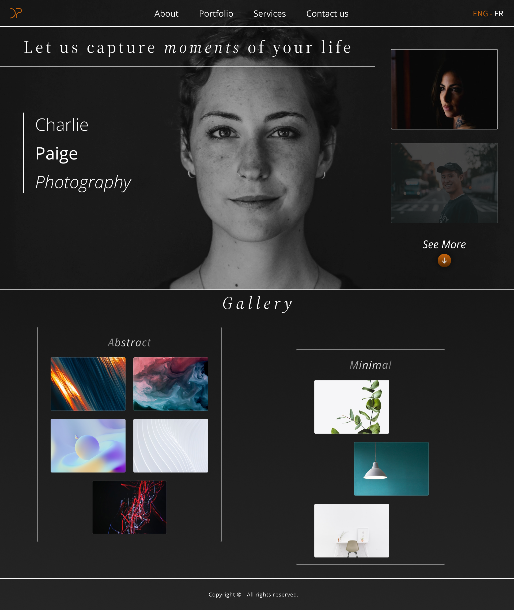

<h1 style="text-align: center;">Charlie Photography</h1>

*Portfolio pour une photographe américaine*

## Objectif

Votre objectif est de réaliser cette intégration en utilisant Flexbox, des balises sémantiques, des class CSS et du background-image.

Les images se trouvent dans le dossier `images/` du projet.

## Charte

Font :
- Open Sans
- Source Serif 4

Couleurs : 
- Orange : #C8650C

Linear-gradients :

- "See More" button : linear-gradient(180deg, #C8650C 0%, #512702 100%);
- Background Bonus : linear-gradient(180deg, #171717 0%, #252525 100%)
- "Abstract" & "Minimal" title : linear-gradient(90deg, rgba(255, 255, 255, 0.4) -0.31%, #FFFFFF 49.69%, rgba(255, 255, 255, 0.4) 99.69%);

---

    <strong>Bonus</strong>

## Si vous êtes toujours chaud

Vous pouvez continuer la deuxième partie du site, ajouter un :hover effect sur les images en changeant leur opacité.

*<ins>Note:</ins> Le linear gradient sur "Abstract" & "Minimal" est délicat à réaliser. Bon courage !*

